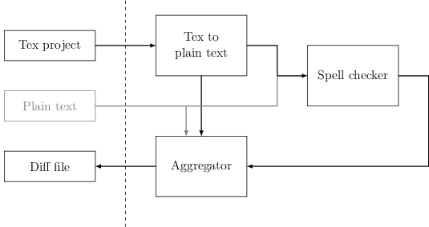

# API

We want to have a modular tool to be able to switch some blocs for other blocs. For example we would to be able to change the block responsible to correct if we want to check different things:

## Tex to plain text
### Input
- a path to .tex file
### Output
- a path to a tmp file which contain the conversion of the the tex to plaintext (remove everything which will not be displayed in the pdf)
- a path to a tmp file which will contain the conversion between the file and the line number of the .tex to the line number of the plain text

## Type checker
### input
- a path to a plaintext file to correct
### output
- a path to a file with the list of error of the plaintext file. For each error we need to know 
  - the line of the plaintext file
  - The errors
  - The context (offset and range ?)
## Aggregator
### input
- a path to a file of errors
- a path to a file making the correspondance between the input file and the plaintext file
### output
- a diff file which will give the list of error with the correspondance to the input text with some context
